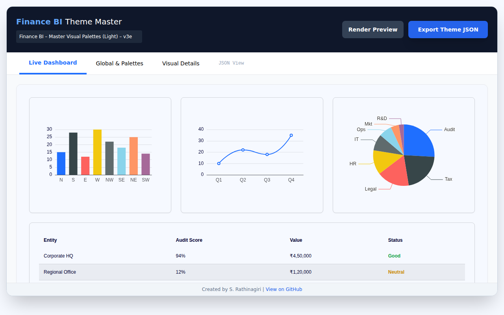
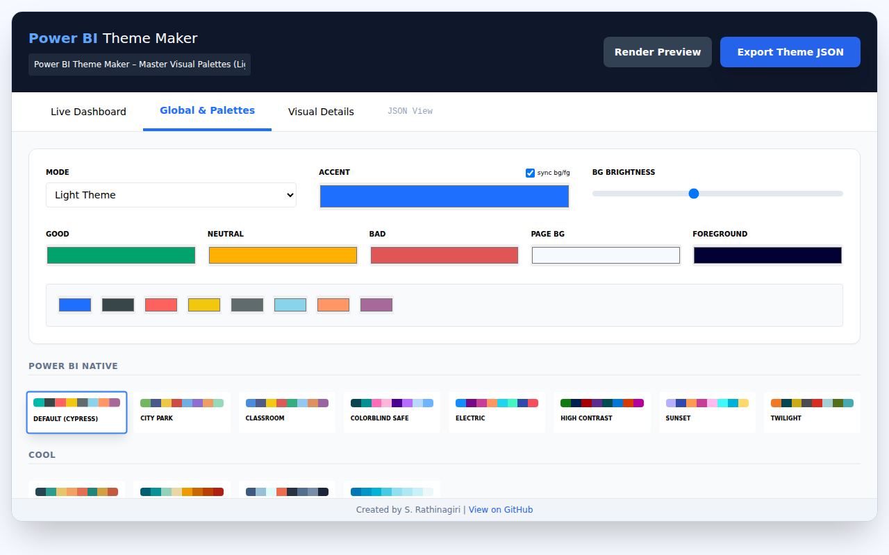

# Finance BI Master Theme Pro

A single-file HTML application for generating, customizing, and validating Power BI JSON themes.

## Description

The **Finance BI Master Theme Pro** is a powerful utility designed to streamline the creation of professional Power BI themes. It allows users to visually design themes, preview them in real-time, and export the resulting JSON configuration for direct import into Power BI.

The tool focuses on consistency, accessibility, and ease of use, providing automatic color calculations for light and dark modes, ensuring optimal contrast and visual harmony across all report elements.

## Features

- **Real-time Live Preview**: Instantly visualize changes on interactive Bar, Line, and Pie charts, as well as a sample Table/Matrix visual.
- **Light & Dark Mode Support**: Toggle between modes with automatic background and foreground color adjustments.
- **Smart Color Calculation**: Automatically derives structural colors (borders, grids, banded rows) based on the primary accent color and background brightness.
- **Extensive Palette Library**: Choose from a wide range of pre-defined color palettes, including:
  - Power BI Native
  - Cool & Warm Tones
  - High Contrast & Modern
  - Gradients (2 & 3 Colors)
  - Nature, Corporate, Vibrant, and Pastel themes.
- **Detailed Visual Customization**: Fine-tune settings for:
  - **Tables & Matrices**: Grid padding, text size, banded rows, row/column headers, subtotals, and specific color overrides.
  - **Slicers**: Header styles, item colors (hover, selected), and slider inputs.
  - **Charts**: Legends, data labels, axes (X/Y show/hide, grid lines), and color assignments.
- **JSON Export**: One-click generation of a validated JSON file ready for Power BI.
- **Single-File Architecture**: No installation required; runs entirely in the browser.

## Screenshots

### Live Dashboard (Preview)
Visualizes the theme on sample charts and tables.

### Global & Palettes (Main)
Set the base mode, accent color, and choose from a variety of palettes.

### JSON View
Inspect and copy the generated JSON code.

## Usage

1.  **Open the Application**: Simply open the `ThemeCreator.html` file in any modern web browser (Chrome, Edge, Firefox, Safari).
2.  **Navigate Tabs**: Use the navigation tabs to access different sections of the tool.
    -   **Live Dashboard**: View the current theme applied to sample visuals.
    -   **Global & Palettes**: Set the base mode (Light/Dark), primary accent color, page background, and choose a data color palette.
    -   **Visual Details**: Configure specific settings for tables, matrices, slicers, and charts.
    -   **JSON View**: Inspect the generated JSON code.
3.  **Customize**: Adjust settings as needed. The preview updates automatically.
4.  **Export**: Click the **Export Theme JSON** button in the top header to download the `.json` file.
5.  **Import to Power BI**: In Power BI Desktop, go to **View** > **Themes** > **Browse for themes** and select the downloaded file.

## Interface Sections

### Live Dashboard
Provides a "what-you-see-is-what-you-get" preview of the theme. It includes:
-   **Charts**: Bar, Line, and Pie charts using the selected data colors.
-   **Table**: A sample table showing headers, rows, totals, and status indicators.

### Global & Palettes
-   **Mode**: Switch between Light and Dark themes.
-   **Accent Color**: The primary color used for key elements. Toggling "sync bg/fg" automatically adjusts background and foreground colors based on the accent.
-   **Status Colors**: Define colors for "Good", "Neutral", and "Bad" KPI indicators.
-   **Palette Selection**: Browse and select from categorized color palettes.

### Visual Details
Granular control over specific visual properties:
-   **General**: Font face, borders, and visual headers.
-   **Table & Matrix**: Grid lines, row colors, contrast headers/totals, and layout options (stepped, subtotals).
-   **Slicers**: Header contrast and item interaction colors.
-   **Charts**: Legend position, data label settings, and axis configurations.

### JSON View
Displays the raw JSON output. This is useful for debugging or manually copying specific sections of the theme code.

## Technologies Used

-   **HTML5 & CSS3**: Core structure and styling.
-   **Tailwind CSS**: For rapid UI development and styling.
-   **ECharts**: For rendering interactive chart previews.
-   **Vanilla JavaScript**: Logic for state management, color calculations, and JSON generation.

## License

This project is open-source and available for personal and commercial use.

## Author

Created by S. Rathinagiri.

[View on GitHub](https://github.com/SRathinaGiri/PowerBIThemeMaker)
